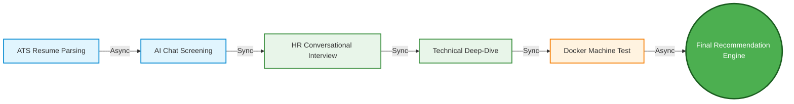
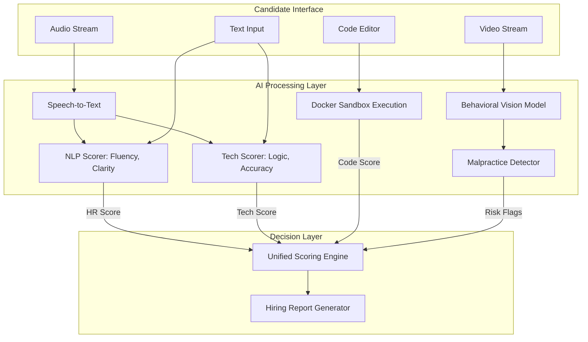
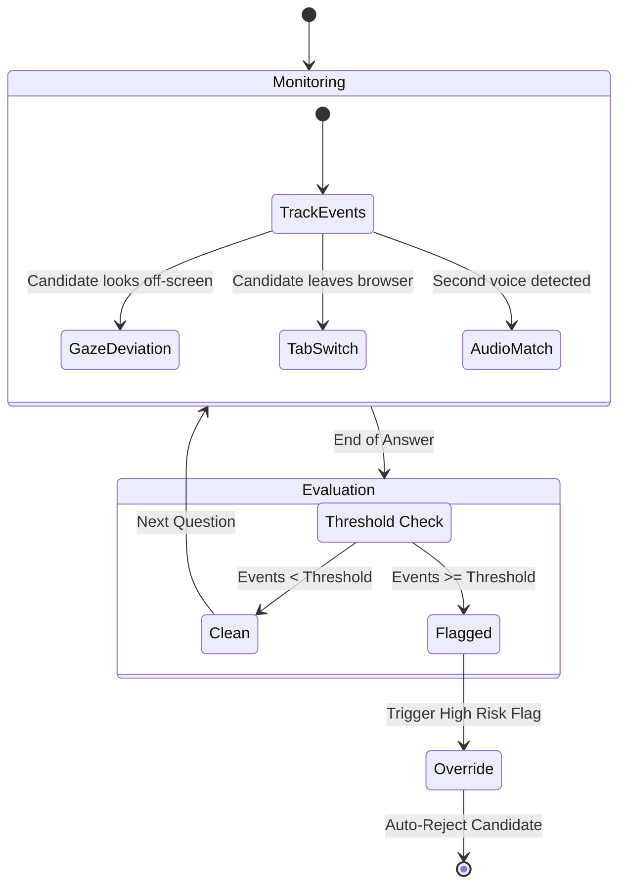

# Zecpath-AI Flowcharts & Diagrams

These diagrams provide a visual overview of the Zecpath-AI architecture and hiring pipeline.

## 1. The 5-Stage Hiring Pipeline

This flowchart illustrates the end-to-end journey of a candidate from resume upload to the final decision.

---

## 2. AI Module Integration & Data Flow

This diagram details how raw candidate inputs (Audio, Video, Code) are processed by specialized AI modules and aggregated into the Unified Scoring Engine.

---

## 3. The Malpractice Detection Logic

This flowchart shows how the system evaluates behavioral signals to catch cheating in real-time.

