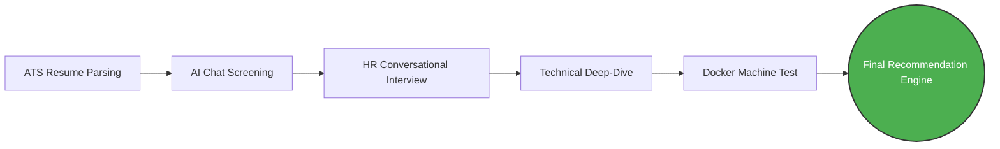
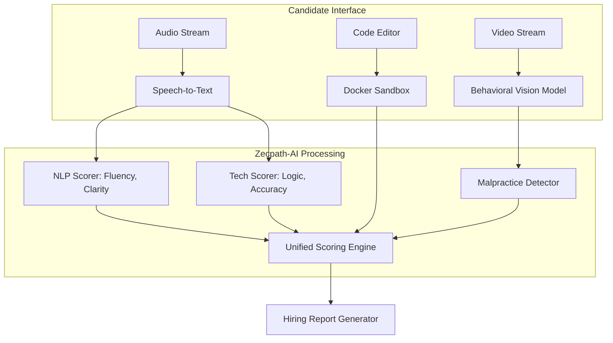

# Zecpath-AI: The Future of Technical Hiring
**Presentation Deck**

---

## Slide 1: The Problem Statement

**Enterprise technical hiring is fundamentally broken.**
- **Inefficient:** Recruiters spend up to 40 hours manually screening resumes and conducting initial phone screens for a single engineering role.
- **Biased:** Human evaluation in early rounds is susceptible to unconscious bias (gender, linguistic, educational background).
- **Inconsistent:** Different interviewers ask different questions and grade on subjective scales, leading to wildly varying candidate quality.
- **Unscalable:** Rapid scaling requires an army of recruiters, creating massive operational overhead.

---

## Slide 2: The AI Solution

**Introducing Zecpath-AI: An End-to-End Automated Hiring Platform.**

**Key Value Propositions:**
1. **Objective Consistency:** Every candidate faces the identical, rigorous evaluation rubric.
2. **Multi-Modal Analysis:** Evaluates behavioral stress, communication clarity, and logic simultaneously.
3. **Enterprise Security:** Built-in `MalpracticeDetector` flags external assistance (e.g., ChatGPT, dual monitors).
4. **Massive Scalability:** Conduct 10,000 interviews concurrently, delivering the top 1% to human recruiters instantly.

---

## Slide 3: System Architecture & AI Modules

### The 5-Stage Hiring Pipeline

### AI Module Integration

---

## Slide 4: Business Impact

**How Zecpath-AI transforms your organization:**

| Metric | Traditional Hiring | Zecpath-AI |
|:---|:---|:---|
| **Time to Screen** | 3-5 days per cohort | < 2 minutes |
| **Recruiter Compute Cost** | ~$250 / hire | < $0.05 / evaluation |
| **Integrity Checks** | Manual / Reactive | Real-time (ChatGPT, Gaze, Tab-switches) |
| **Bias Mitigation** | Unconscious human bias | Dynamic toggles for non-native English speakers |

**ROI:** A 90% reduction in early-stage recruitment costs and a guarantee of a consistent, unbiased technical baseline for all incoming engineers.

---

## Slide 5: Q&A

**Thank you for your time.** 
We will now open the floor to questions regarding:
- Architecture & Infrastructure Costs
- AI Bias Mitigation Strategies
- Security & Malpractice Detection Rules
- Custom Integrations (Workday, Greenhouse)

---
*End of Deck*
