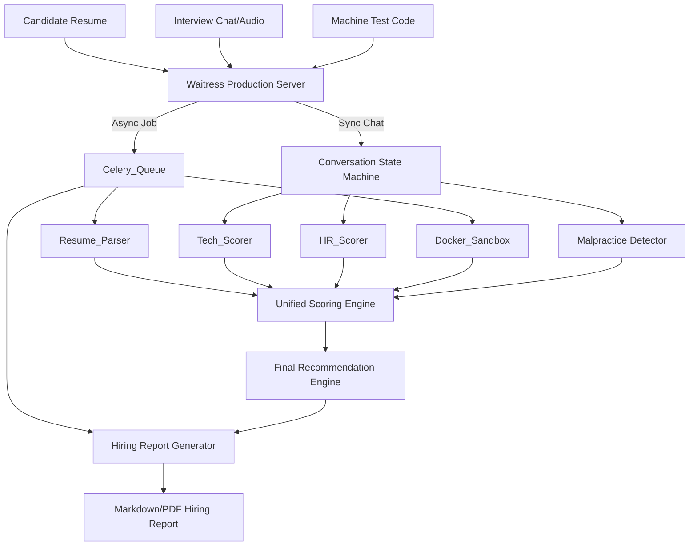

# System Architecture Document
**Version:** Production V2

## 1. Core Architecture Principles

The Zecpath-AI system operates as an intelligent pipeline that ingests candidate data across 5 distinct stages, processes the data using specialized AI engines, and outputs a final, unified hiring recommendation. It is designed to be **stateless**, **fault-tolerant**, and **highly concurrent**.

### 5-Stage Pipeline
1. **ATS & Resume Parsing (Async):** Extracts skills and experience from uploaded PDFs via background workers (Celery/Redis).
2. **AI Screening (Sync):** A rapid text-based chatbot that filters for basic domain knowledge.
3. **HR Interview (Sync):** A conversational agent evaluating communication, culture fit, and behavioral signals (stress, sentiment, contradiction) using NLTK and spaCy.
4. **Technical Interview (Sync):** Evaluates the depth, logic, and applicability of technical concepts using regex-compiled heuristics and contextual matching.
5. **Machine Test (Async):** Executes un-trusted candidate code in an isolated Docker sandbox to prevent malicious arbitrary code execution.

---

## 2. Component Workflow Diagram



---

## 3. Data Models

### A. Candidate Profile Model
Passed between engines to maintain state. In production, this resides in Redis to allow any API pod to pick up the next conversational turn seamlessly.
```json
{
  "candidate_id": "c_123",
  "role": "senior_developer",
  "active_stage": "technical_interview",
  "scores": {
    "ats": 0.85,
    "screening": 0.90,
    "hr": null,
    "technical": null,
    "machine_test": null
  },
  "flags": ["INT-02", "PAT-A"]
}
```

### B. Scoring Configuration Model
Loaded into memory at boot from `config/unified_scoring_config.json` and cached via `lru_cache` for O(1) retrieval speed.
```json
{
  "role_weights": {
    "senior_developer": {
      "ats": 0.15,
      "screening": 0.15,
      "hr": 0.20,
      "technical": 0.25,
      "machine_test": 0.25
    }
  }
}
```

---

## 4. Processing Paradigms

### Stateless Conversation Flow
The `InterviewConversationFlow` is a finite state machine (`GREETING -> ASKING -> ANALYZING -> FOLLOW_UP -> CLOSING`). The state is held external to the application memory (via session hashes), meaning any Waitress thread can process the next message in an interview without dropping context.

### The Integrity Override System
The `MalpracticeDetector` runs concurrently to the interview flow. If a candidate triggers high-severity alerts (e.g., switching tabs >= 12 times, or exhibiting a "Look Away + Paste + Perfect Answer" pattern), the detector bypasses standard weighting.

### Hybrid Rule-Based Decision Logic
The `FinalRecommendationEngine` relies on a hybrid approach:
1. **Mathematical Aggregation:** Calculates the raw percentage fit via strict bounds clamping.
2. **Hard Heuristics:** If integrity risk is `HIGH`, or technical score is `< 40`, the candidate is instantly flagged as `REJECTED` regardless of their overall average. This ensures high-quality floors for enterprise hiring.
