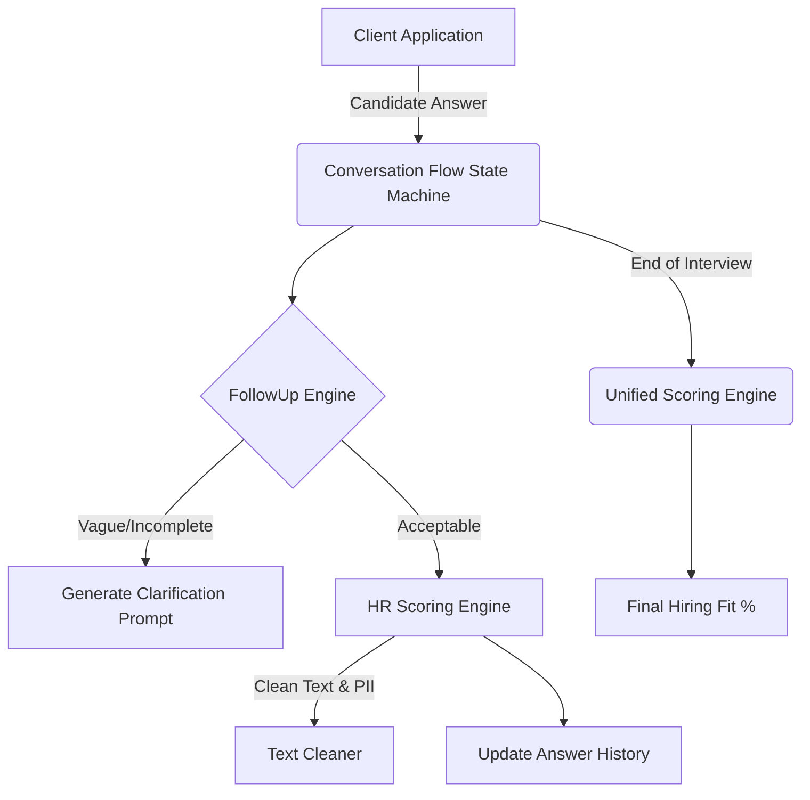

# HR Interview AI - System Architecture

## 1. High-Level Overview
The Zecpath-AI HR Interview system is a state-machine driven conversational agent designed to evaluate candidate responses in real-time. It consists of a conversation controller, a set of adaptive follow-up heuristics, and a multi-layered scoring engine.

## 2. Core Components

### 2.1 Conversation Flow (`interview_ai/conversation_flow.py`)
Acts as the central orchestrator. It maintains the `ConversationState` (GREETING, WAITING_FOR_ANSWER, FOLLOW_UP, CLOSING, TERMINATED). For every candidate message, it determines whether to advance to the next question or ask a follow-up.

### 2.2 Follow-Up Engine (`utils/followup_engine.py`)
Evaluates the immediate quality of a single answer. It uses simple word-count heuristics and internal flags to determine if an answer is `vague` or `incomplete`, triggering dynamic clarification prompts. It is bounded by a `max_follow_up_per_question` limit to prevent infinite loops.

### 2.3 HR Scoring Engine (`utils/hr_scoring_engine.py`)
Evaluates the semantic content of the answers.
*   **Relevance:** Checks for keyword overlap (simulating ATS checks).
*   **Consistency:** Compares the current answer against the `answer_history` to penalize contradictory statements.
*   Outputs a normalized `0-100` score representing the HR viability of the candidate.

### 2.4 Unified Scoring Engine (`utils/unified_scoring_engine.py`)
Aggregates the HR Score with theoretical upstream scores (e.g., initial ATS resume parse, Technical Screening). Applies role-specific weight adjustments (e.g., heavily weighting ATS for Junior roles, heavily weighting HR for Senior roles).

### 2.5 Data Retention (`utils/data_retention.py`)
Handles compliance by allowing immediate purging or anonymization of candidate data post-evaluation.
