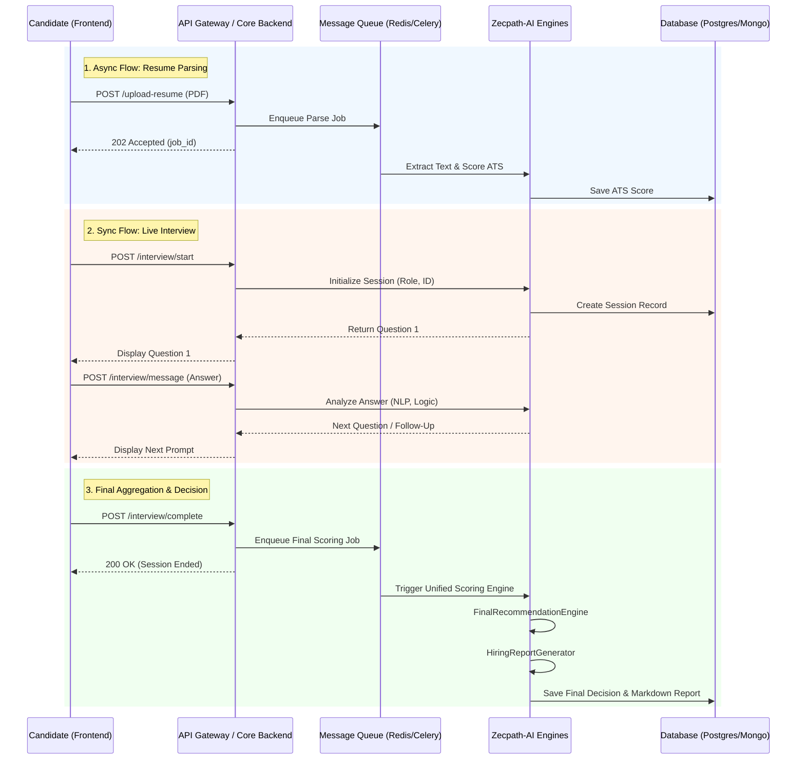

# API Mapping Diagram

This diagram visualizes the flow of data between the candidate frontend, the core backend, and the Zecpath-AI microservices.

### Module-to-Endpoint Mapping

| AI Module | Primary API Endpoint | Processing Model |
|---|---|---|
| **Resume Parser & ATS** | `POST /api/v1/resume/parse` | Asynchronous |
| **Screening Chatbot** | `POST /api/v1/screening/message` | Synchronous |
| **HR / Tech Interview** | `POST /api/v1/interview/<session_id>/message` | Synchronous |
| **Behavioral Monitor** | `WS /api/v1/behavioral/stream` | WebSocket (Sync) |
| **Machine Test Evaluator** | `POST /api/v1/machine-test/evaluate` | Asynchronous |
| **Decision & Reporting** | `POST /api/v1/interview/<session_id>/finalize` | Asynchronous |
