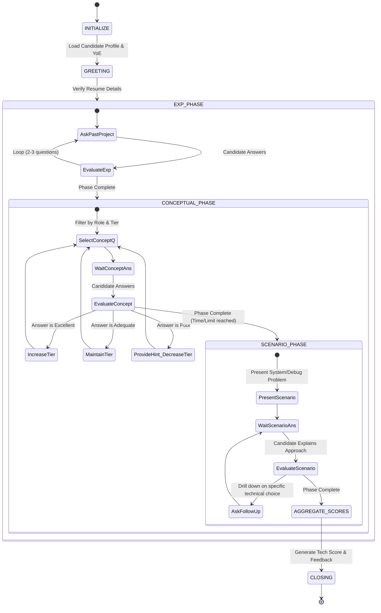

# Technical Interview Flow Design

This diagram illustrates the state machine for the Technical Interview AI.

## State Descriptions
*   **INITIALIZE:** System loads ATS parsing data to know the candidate's stack and sets the initial difficulty tier.
*   **CONCEPTUAL_PHASE:** The engine loops through rapid-fire knowledge questions, actively adjusting the `Tier` up or down based on the `EvaluateConcept` heuristic.
*   **SCENARIO_PHASE:** Focuses on a single, long-form question. The AI acts as a collaborative partner, asking probing follow-ups (e.g., "Why did you choose Redis over Memcached for that layer?").
*   **AGGREGATE_SCORES:** The Technical Scoring Engine computes metrics for *Accuracy*, *Problem Solving*, *Depth of Knowledge*, and *Communication of Technical Concepts*.
